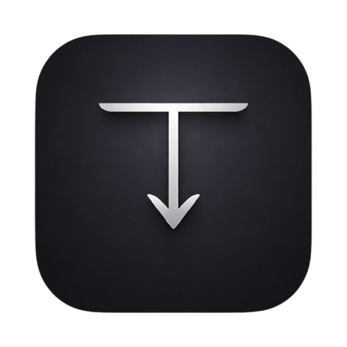

# TikSave

<div align="center">



**A professional TikTok downloader built exclusively for macOS**

[](https://www.apple.com/macos/)
[](https://swift.org/)
[](LICENSE)

[Download Latest Release](../../releases/latest) • [Report Bug](../../issues) • [Request Feature](../../issues)

</div>

---

## ✨ Features

### 🎬 Video Download
- **No Watermark Downloads** - Get clean videos without TikTok watermark
- **Audio Extraction** - Download audio as MP3 format
- **Batch Downloads** - Queue multiple videos with concurrent downloading
- **TikTok Stalker** - View detailed TikTok profile information

### ⚙️ Customization
- **Custom Output Folder** - Choose where to save your downloads
- **Filename Templates** - Customize how files are named
- **File Organization** - Auto-organize by type and creator
- **Download History** - Track all your downloads

### 🎨 User Experience
- **Dark Mode** - Beautiful dark, minimalist, Apple-style UI
- **Native macOS App** - Built with SwiftUI for optimal performance
- **Privacy-Focused** - All processing happens locally on your Mac
- **No Tracking** - Zero analytics, zero data collection

---

## 📥 Installation

### Download DMG Installer

1. **Download** the latest `TikSave-Installer.dmg` from [Releases](../../releases/latest)
2. **Open** the DMG file
3. **Drag** TikSave.app to Applications folder
4. **Launch** TikSave from Applications or Launchpad

### System Requirements

- **macOS 13.0** (Ventura) or later
- **Apple Silicon** (M1/M2/M3) or Intel Mac
- **Internet connection** for downloading videos

---

## 🚀 Quick Start

1. **Copy** a TikTok video URL
2. **Paste** into TikSave
3. **Click** the download button
4. **Done!** Video saved to your chosen folder

### Supported URL Formats

```
https://www.tiktok.com/@username/video/1234567890
https://vm.tiktok.com/XXXXXXXXX/
https://vt.tiktok.com/XXXXXXXXX/
```

---

## 🎯 Key Features Explained

### Download Options

- **No Watermark** - Clean video without TikTok branding
- **With Watermark** - Original video with TikTok watermark
- **Audio Only** - Extract audio as MP3 file

### File Organization

Organize downloads automatically:
- By content type (video/audio)
- By creator username
- Custom subfolder patterns

### Automation

- **Auto-fetch on paste** - Automatically fetch metadata when URL is pasted
- **Auto-download** - Start download immediately after fetch
- **Hands-free mode** - Fully automatic clipboard monitoring
- **Custom notifications** - Get notified when downloads complete

---

## 🔒 Privacy & Security

- ✅ **100% Local Processing** - No cloud, no servers, no tracking
- ✅ **No Data Collection** - We don't collect any user data
- ✅ **No Analytics** - Zero tracking or telemetry
- ✅ **Open Source** - Code is transparent and auditable
- ✅ **Sandboxed** - macOS sandbox for enhanced security

[Read Privacy Policy](PRIVACY_POLICY.md) • [Read Terms of Service](TERMS_OF_SERVICE.md)

## Architecture

### MVVM Pattern
- **Models**: `TikwmModels.swift` - API response, download items, collections
- **Views**: SwiftUI views in `Views/` directory
- **ViewModels**: Observable objects for state management

### Services Layer
- **TikwmAPIClient**: Async/await API client for TikWM service
- **DownloadManager**: Queue management with concurrency control
- **Storage**: Local data persistence (CoreData/SQLite ready)

### Key Components
- **Sidebar Navigation**: Tab-based navigation with queue badges
- **Video Preview Card**: Rich preview with thumbnails and metadata
- **Download Queue Row**: Progress tracking with pause/resume/cancel
- **Reusable Components**: Modular UI components for consistency

## Requirements

- **macOS 13.0+** (Ventura)
- **Xcode 15.0+**
- **Swift 5.9+**
- **Apple Silicon or Intel Mac**

## Build Instructions

### 1. Open Project
```bash
open TikSave.xcodeproj
```

### 2. Configure Signing
- Set your Development Team in project settings
- Bundle Identifier: `com.tiksave.app`
- Enable automatic code signing

### 3. Sandbox Configuration
The app is sandboxed with the following entitlements:
- Network client (for API calls)
- User-selected file read/write (for custom output folders)
- Downloads folder access (default output location)

### 4. Build & Run
- Select "My Mac" as destination
- Press Cmd+R to build and run
- Or use Product → Archive for distribution build

## API Integration

### TikWM API Endpoint
```
GET https://tikwm.com/api/?url={ENCODED_TIKTOK_URL}
```

### Response Structure
```json
{
  "code": 0,
  "msg": "success", 
  "data": {
    "id": "video_id",
    "title": "video_title",
    "author": { "nickname": "...", "unique_id": "..." },
    "play": "video_url_no_watermark",
    "wmplay": "video_url_with_watermark",
    "music": "audio_url",
    "cover": "thumbnail_url",
    "duration": 78,
    "stats": { "play_count": 12345, ... }
  }
}
```

## File Structure

```
TikSave/
├── TikSaveApp.swift              # App entry point
├── ContentView.swift             # Root view
├── Models/
│   └── TikwmModels.swift         # Data models
├── Services/
│   ├── TikwmAPIClient.swift      # API client
│   └── DownloadManager.swift     # Download queue management
├── Views/
│   ├── MainContentView.swift     # Navigation split view
│   ├── SidebarView.swift         # Sidebar navigation
│   ├── DownloadView.swift        # Main download interface
│   ├── RandomView.swift          # Random mode (placeholder)
│   ├── CollectionsView.swift     # Collections (placeholder)
│   ├── LibraryView.swift         # Library (placeholder)
│   ├── SettingsView.swift        # App settings
│   └── Components/
│       ├── VideoPreviewCard.swift
│       ├── DownloadQueueRow.swift
│       ├── StatPill.swift
│       └── EmptyStateView.swift
├── Assets.xcassets/              # Images, icons, colors
└── TikSave.entitlements          # Sandbox permissions
```

## Security & Privacy

- **Local Storage Only**: No cloud sync or analytics
- **Sandboxed**: Limited file system access
- **No Tracking**: No user behavior analytics
- **Privacy Compliant**: Respects user content rights

---

## 📸 Screenshots

<div align="center">

### Download View
*Clean, minimalist interface for downloading TikTok videos*

### TikTok Stalker
*View detailed profile information*

### Settings
*Customize everything to your preference*

### Download History
*Track all your downloads*

</div>

---

## ❓ FAQ

### Is TikSave free?
Yes! TikSave is completely free and open source.

### Does it work on older Macs?
TikSave requires macOS 13.0 (Ventura) or later. It supports both Apple Silicon and Intel Macs.

### Is my data safe?
Absolutely! All processing happens locally on your Mac. We don't collect, store, or transmit any data.

### Can I download private videos?
No, TikSave can only download publicly available videos.

### Does it support batch downloads?
Yes! You can queue multiple videos and download them simultaneously.

### Where are videos saved?
By default, videos are saved to your Downloads folder. You can change this in Settings.

---

## 🛠️ Troubleshooting

### App won't open
- Right-click the app and select "Open"
- Go to System Settings → Privacy & Security and allow the app

### Download fails
- Check your internet connection
- Verify the TikTok URL is correct and the video is public
- Try again in a few moments

### Can't change output folder
- Make sure you have write permissions to the folder
- Try selecting a different folder

### Need more help?
[Open an issue](../../issues) on GitHub and we'll help you out!

---

## 🏗️ For Developers

### Build from Source

```bash
# Clone repository
git clone https://github.com/miftahganzz/tiksave.git
cd tiksave

# Open in Xcode
open TikSave.xcodeproj

# Build and run (Cmd+R)
```

### Tech Stack
- **Language**: Swift 5.9+
- **Framework**: SwiftUI
- **Architecture**: MVVM
- **API**: Tikwm API
- **Minimum**: macOS 13.0

### Project Structure
```
TikSave/
├── Views/           # SwiftUI views
├── Models/          # Data models
├── Services/        # API client, managers
├── ViewModels/      # View models
└── Assets.xcassets/ # Icons, images
```

---

## ⚠️ Disclaimer

**Important**: This app is for personal use only. Users must:
- Respect content creators' rights
- Comply with TikTok's Terms of Service
- Only download content they have permission to use
- Not use downloaded content for commercial purposes without permission

TikSave does not encourage or support copyright infringement. Always respect intellectual property rights.

---

## 📄 License

This software is proprietary and provided for **personal use only**. See the [LICENSE](LICENSE) file for full terms.

**You are NOT allowed to**: modify, redistribute, reverse engineer, or use commercially.  
**You are allowed to**: download and use for personal, non-commercial purposes only.

---

## 🙏 Acknowledgments

- Built with [Swift](https://swift.org/) and [SwiftUI](https://developer.apple.com/xcode/swiftui/)
- Uses [Tikwm API](https://tikwm.com/) for video metadata
- Icon design inspired by Apple's design language

---

## 📞 Contact

- **GitHub**: [@miftahganzz](https://github.com/miftahganzz)
- **Website**: [miftah.is-a.dev](https://miftah.is-a.dev)
- **Issues**: [Report a bug](../../issues/new)

---

<div align="center">

**Built with ❤️ for macOS users**

⭐ Star this repo if you find it useful!

[Download Now](../../releases/latest) • [View Source](../../) • [Report Issue](../../issues)

</div>
