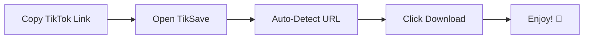

# 🎬 TikSave

<div align="center">


**The Ultimate TikTok Video Downloader for macOS**

Fast • Simple • Watermark-Free • Native macOS App

[⬇️ Download Latest Release](https://github.com/miftahganzz/TikSave/releases/latest/download/TikSave.dmg) • [📖 Documentation](#how-to-use) • [⭐ Star this repo](https://github.com/miftahganzz/TikSave)

---
</div>


## ✨ Features

<div align="center">
<table>
<tr>
<td width="50%">

### 🚀 **Core Features**
- ⚡️ Lightning fast downloads
- 💧 100% watermark-free
- 🎵 Audio extraction
- 👤 Profile downloads
- 📱 Native macOS app

</td>
<td width="50%">

### 🎯 **Advanced Features**
- 🔄 Batch downloads queue
- 📋 Smart URL detection
- 🎨 Beautiful Swift UI
- 🌐 No account required
- ⚙️ Custom quality settings

</td>
</tr>
</table>
</div>

---

## 📦 Quick Installation

### Method 1: Direct Download (Recommended)
```bash
# Download the latest DMG
curl -LO https://github.com/miftahganzz/TikSave/releases/latest/download/TikSave.dmg

# Mount and install
open TikSave.dmg
# Then drag to Applications folder
```

### Method 2: Manual Download
1. Go to [Releases Page](https://github.com/miftahganzz/TikSave/releases)
2. Download `TikSave.dmg`
3. Install by dragging to Applications

---

## 🎯 How to Use

### 30-Second Quick Start



### Detailed Steps

#### 📱 **From TikTok App**
1. Open TikTok and find your video
2. Tap the **Share** button (→)
3. Select **Copy Link**
4. Open TikSave - link auto-detects!
5. Click **Download** and choose location

#### 💻 **From Web Browser**
1. Navigate to TikTok video
2. Copy URL from address bar
3. Paste into TikSave
4. Select quality preferences
5. Download and enjoy!

---

## 🎨 Advanced Features

<div align="center">

### **Profile Download Mode**
| Feature | Description |
|---------|-------------|
| 👤 Profile Picture | Download HD profile images |
| 📊 User Info | Export profile statistics |
| 🎥 All Videos | Batch download user's public videos |
| 📝 Bio & Links | Save profile description |

### **Audio Extraction**
```bash
🎵 MP3 Format - High quality audio only
🎧 M4A Format - Compatible with Apple devices
🎼 Original - Keep original audio quality
```

</div>

---

## 📸 Screenshots

<div align="center">
  
### Main Interface


### Settings & Preferences


</div>

---

## 🔒 Privacy First

### 🛡️ **Your Data Stays Yours**

```
╔════════════════════════════════════╗
║         PRIVACY PROMISE            ║
╠════════════════════════════════════╣
║ ✅ No data collection              ║
║ ✅ No analytics or tracking        ║
║ ✅ No third-party services         ║
║ ✅ All processing on your device   ║
║ ✅ No account required             ║
╚════════════════════════════════════╝
```

### 🔐 **Security Features**
- End-to-end encrypted connections
- No login credentials stored
- Automatic clipboard clearing option
- Sandboxed application environment

---

## 💻 System Requirements

| Requirement | Minimum | Recommended |
|------------|---------|-------------|
| **macOS** | 11.0 (Big Sur) | 13.0 (Ventura) |
| **RAM** | 256 MB | 512 MB |
| **Storage** | 50 MB | 100 MB |
| **Processor** | Intel/Apple Silicon | Apple Silicon |

---

## ❓ Frequently Asked Questions

<details>
<summary><strong>🤔 Is TikSave really free?</strong></summary>
<br>
✅ Yes! TikSave is completely free with no hidden costs, subscriptions, or in-app purchases. No credit card required, ever!
</details>

<details>
<summary><strong>🔒 Why is the license proprietary?</strong></summary>
<br>
The app is distributed as a compiled binary to protect the intellectual property and ensure the best user experience. The license file indicates it's proprietary software, meaning the source code is not publicly available.
</details>

<details>
<summary><strong>⚡ Why is it faster than other downloaders?</strong></summary>
<br>
TikSave uses optimized Swift code and efficient download algorithms specifically tuned for TikTok's infrastructure. Native macOS integration also reduces overhead.
</details>

<details>
<summary><strong>📱 Can I download private videos?</strong></summary>
<br>
No, TikSave respects privacy settings and can only download publicly available content, just like a web browser would see them.
</details>

<details>
<summary><strong>🔄 Will this work with future TikTok updates?</strong></summary>
<br>
We actively maintain TikSave to ensure compatibility with TikTok updates. Check the releases page for the latest version.
</details>

<details>
<summary><strong>⚠️ macOS says "App is damaged" or won't open?</strong></summary>
<br>
This is normal for apps outside the App Store. To fix:
1. Right-click the app → Select **Open**
2. Click **Open** in the dialog
3. That's it! The app will now work normally
</details>

---

## 🚀 Performance Tips

### For Best Results:
- 📶 Use stable WiFi connection
- 🔄 Update to latest TikSave version
- 💾 Save to local drive (not cloud storage)
- ⚡ Close unused apps while batch downloading

### Batch Download Limits:
- 🎥 Max 50 videos per session
- 📦 2GB total size recommended
- ⏱️ 10 minutes maximum queue time

---

## 📝 Version History

### **v1.0.0** (March 2026)
```
✨ Initial Release Features:
├── 🎯 Core download functionality
├── 💧 Watermark removal
├── 🎵 Audio extraction
├── 👤 Profile downloads
├── 🎨 Native macOS interface
├── 📋 Clipboard auto-detection
└── ⚡ Lightning fast performance
```

---

## 📜 License Information

**TikSave** is distributed as a compiled binary with **Proprietary License**.

```
Copyright © 2026 Miftah Ganzz. All rights reserved.

This software is provided as a compiled binary for personal use only.
Redistribution, modification, or reverse engineering is prohibited.

For licensing inquiries, please contact the author.
```

---

## 👨‍💻 Developer

<div align="center">

### **Miftah Ganzz**
[](https://github.com/miftahganzz)
[](https://github.com/miftahganzz/TikSave)

</div>

---

## 🤝 Support & Community

### Ways to Support:
- ⭐ **Star** this repository
- 📢 **Share** with friends
- 🐛 **Report** bugs
- 💡 **Suggest** features
- 💬 **Join** discussions

### Contact:
- **Issues**: [GitHub Issues](https://github.com/miftahganzz/TikSave/issues)
- **Discussions**: [GitHub Discussions](https://github.com/miftahganzz/TikSave/discussions)
- **Email**: [Contact Form](https://github.com/miftahganzz)

---

## ⚠️ Legal Disclaimer

```
TikSave is an independent project and is NOT affiliated with,
endorsed by, or connected to TikTok, ByteDance Ltd., or any of
their subsidiaries.

TikTok™ is a trademark of ByteDance Ltd.

This tool is for EDUCATIONAL and PERSONAL USE only. Users are
responsible for ensuring compliance with:
• TikTok's Terms of Service
• Local laws and regulations
• Copyright and intellectual property rights
• Content creators' rights

The developer assumes NO LIABILITY for any misuse of this software.
Download only content you have permission to use.
```

---

## 📊 GitHub Stats

<div align="center">

[](https://star-history.com/#miftahganzz/TikSave&Date)


</div>

---

<div align="center">

### **Made with ❤️ for the macOS community**

[⬆ Back to Top](#-tiksave)

---

*Happy Downloading! 🎉*

</div>
