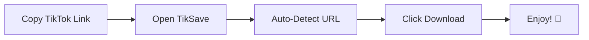

# 🎬 TikSave

<div align="center">


**Save TikToks. Watermark-free. Natively.**

Download high-quality videos, photo slideshows, and audio tracks directly to your macOS, Windows, or Android device. Fast, private, and completely free of ads.

[⬇️ Get macOS App](#download) • [🤖 Get Android App](#download) • [💻 Get Windows App](#download) • [📖 View Source Code](https://github.com/miftahganzz/TikSave)

---
</div>

## 🚀 Why TikSave?

### **Built for macOS, Windows & Android, not for ads.**

Most TikTok downloaders are web pages cluttered with sketchy redirects, cookie banners, and video ads. TikSave is different.

We build dedicated native applications for macOS, Windows, and Android. Whether running as a menu bar helper on your Mac, a lightweight desktop app on Windows, or a mobile client on your Android device, TikSave processes downloads directly between your system and TikTok's CDN network. That means faster downloads, offline library management, zero tracking, and no intrusive web redirects.

---

## ✨ Features

<div align="center">

### **Built for creators.**
*Simple layouts doing one thing: getting the job done.*

</div>

<table>
<tr>
<td width="50%">

#### 🎥 **HD Video & Audio**
Grab high-definition video streams without watermarks, or convert and download audio-only clips directly into 320kbps MP3 tracks.

#### 🖼️ **Slideshows & Photos**
Batch download photo slides from image posts. Features an interactive Selector Modal to grab specific images or download the entire stack.

#### 👤 **Creator Profile Insights**
Search creator profiles directly inside the app. Inspect accounts, check posting stats, and download public stories without logging in.

#### 📚 **Library & Offline Media Player**
Browse and search downloaded files in your local library. Play videos, listen to audio with album arts, and view slides without opening Finder or your device's file manager.

</td>
<td width="50%">

#### 📂 **Collection & History Manager**
Group files into custom folders (e.g. "Reference Content"). A local history tracker archives past URLs, file sizes, and date added.

#### 📋 **Smart Clipboard**
Scan clipboard links automatically when you focus the window. Enable Auto-Download to start saving files as soon as you copy a link.

#### 🔔 **Customization & Alerts**
Rename files dynamically using properties like `{username}_{video_id}`. Sort files by media type automatically and trigger desktop alerts with the custom TikSave Chime sound when downloads finish.

#### 🔄 **Automatic Updates**
TikTok changes fast. TikSave keeps up — silently, in the background. Native updates for macOS, WinSparkle for Windows, and smart hot updates for Android.

</td>
</tr>
</table>

---

## 🎯 How to Use

### 30-Second Quick Start


```mermaid
graph LR
    A[Copy TikTok Link] --> B[Open TikSave]
    B --> C[Auto-Detect URL]
    C --> D[Click Download]
    D --> E[Enjoy! 🎉]
```

### Detailed Steps

#### 📱 **From TikTok App**
1. Open TikTok and find your video
2. Tap the **Share** button (→)
3. Select **Copy Link**
4. Open TikSave - link auto-detects!
5. Click **Download** and choose location

#### 💻 **From Web Browser**
1. Navigate to TikTok video
2. Copy URL from address bar
3. Paste into TikSave
4. Select quality preferences
5. Download and enjoy!

---

## 🛠️ Architecture

<div align="center">

### **Natively Optimized**
*Light on battery, heavy on speed. Compiled natively for macOS, Windows & Android.*

</div>

| Technology | Description |
|------------|-------------|
| **Swift & SwiftUI** | Powers the macOS app. Compiled to a native binary for instant launch, menu bar support, and integration with the macOS system. |
| **Flutter & Dart** | Powers both the Windows and Android apps. Delivers native desktop and mobile performance, clean Fluent/Material rendering, and high-efficiency background downloading. |
| **Combine & Dart Streams** | Asynchronous reactive pipelines that handle downloading, media parsing, and background networking seamlessly. |
| **AVKit, ExoPlayer & MediaKit** | Core media engines. Provide high-fidelity in-app video playback, audio streams, and local library organization across macOS, Windows, and Android. |
| **Native Notifications** | Integrates with macOS UserNotifications, Windows Toast Notifications, and Android Notification Channels to alert you with progress trackers. |
| **TikSave Server** | A unified parser interface. Safely streams video parameters, HD streams, photo sliders, and creator assets directly from the CDN. |

---

## 🔄 Automatic Updates

<div align="center">

### **Always up to date. Automatically.**

</div>

| Platform | Update Mechanism |
|----------|------------------|
| 🍏 **macOS** | **Native macOS Updates.** When a new release is available, TikSave prompts you with a native macOS dialog. Review changes and install with a single click. |
| 💻 **Windows** | **Native Windows Updates.** Integrates the WinSparkle framework. It runs seamlessly in the background and alerts you with a clean update dialog when a new version is ready. |
| 🤖 **Android** | **Background Smart Updates.** Receives hot updates silently in the background. Fixes apply instantly the next time you open the app — no reinstall needed. |

---

## 📦 Download

Get the latest version of TikSave for your platform.

| Platform | Download Link |
|----------|---------------|
| 🍏 **macOS** | [Download TikSave for macOS (v1.1.12)](https://github.com/miftahganzz/TikSave/releases/latest/download/TikSave.dmg) |
| 🤖 **Android** | [Download TikSave for Android (.apk)](https://github.com/miftahganzz/TikSave/releases/latest/download/TikSave.apk) |
| 💻 **Windows** | [Download TikSave for Windows (.exe)](https://github.com/miftahganzz/TikSave/releases/latest/download/TikSave.exe) |
| 💻 **Source Code** | [View Source Code on GitHub](https://github.com/miftahganzz/TikSave) |

---

## 💻 System Requirements

| Requirement | Specification |
|-------------|---------------|
| **macOS Version** | macOS 13.0 (Ventura) or newer |
| **Android Version** | Android 13.0 (Tiramisu) or newer |
| **Windows Version** | Windows 10 / 11 or newer |
| **File Storage Size** | Lightweight (under 30 MB) |

---

## 📸 Screenshots

<div align="center">
  
### Main Interface


### Settings & Preferences


</div>

---

## 🔒 Privacy First

### **100% Open-Source & Tracker-Free**

```
╔════════════════════════════════════╗
║         PRIVACY PROMISE            ║
╠════════════════════════════════════╣
║ ✅ 100% open-source tool           ║
║ ✅ Zero spyware or analytics       ║
║ ✅ No advertising scripts          ║
║ ✅ No intrusive web redirects      ║
║ ✅ No account required             ║
╚════════════════════════════════════╝
```

---

## 📜 License Information

**TikSave** is Free and Open Source software.

```
Copyright (c) 2026 miftahganzz

Free and Open Source • Safe & Secure • No Adware
```

---

## 👨‍💻 Developer

<div align="center">

### **Miftah Ganzz**
[](https://github.com/miftahganzz)
[](https://github.com/miftahganzz/TikSave)

</div>

---

## ⚠️ Legal Disclaimer

```
TikSave is an independent project and is NOT affiliated with,
endorsed by, or connected to TikTok, ByteDance Ltd., or any of
their subsidiaries.

TikTok™ is a trademark of ByteDance Ltd.

This tool is for EDUCATIONAL and PERSONAL USE only. Users are
responsible for ensuring compliance with:
• TikTok's Terms of Service
• Local laws and regulations
• Copyright and intellectual property rights
• Content creators' rights

The developer assumes NO LIABILITY for any misuse of this software.
Download only content you have permission to use.
```

---

## 📊 GitHub Stats

<div align="center">

[](https://star-history.com/#miftahganzz/TikSave&Date)


</div>

---

<div align="center">

### **Free and Open Source • Safe & Secure • No Adware • macOS + Android + Windows**

[⬆ Back to Top](#-tiksave)

---

*Happy Downloading! 🎉*

</div>
